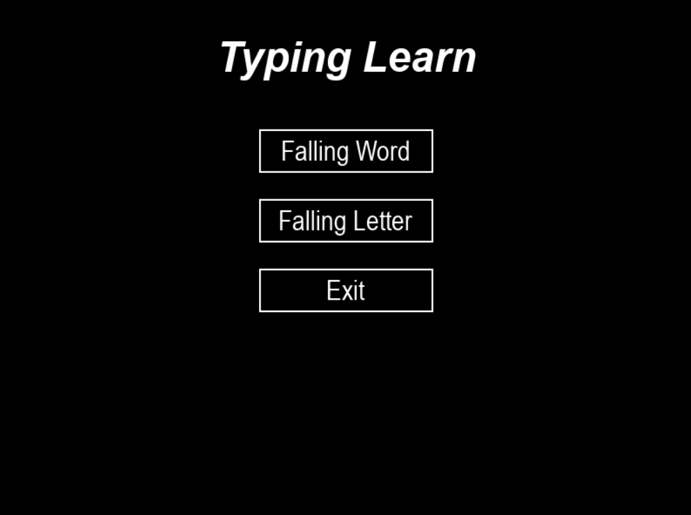
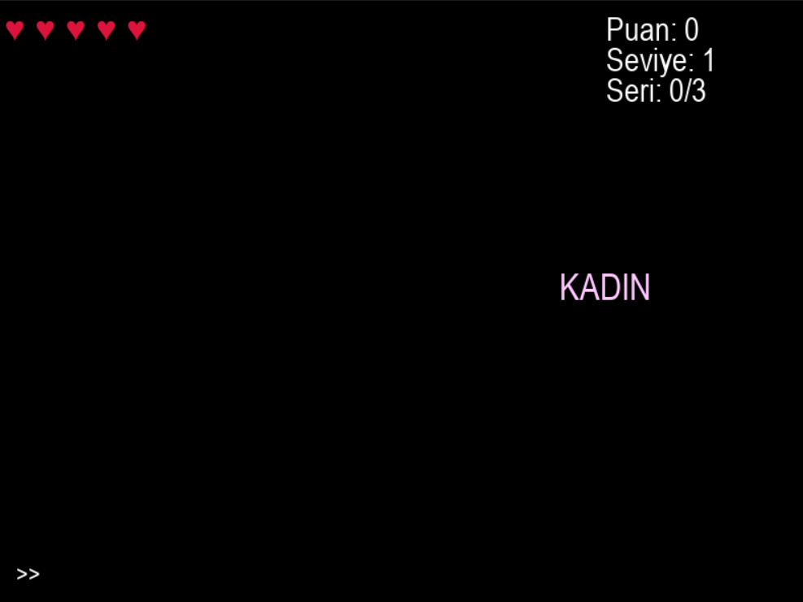
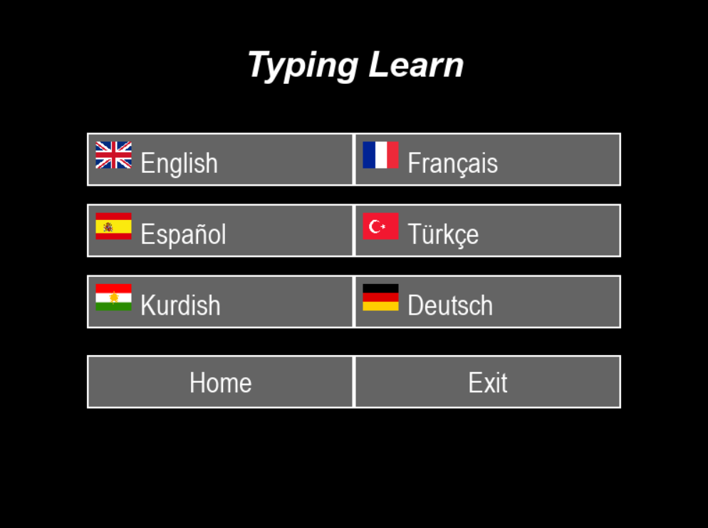
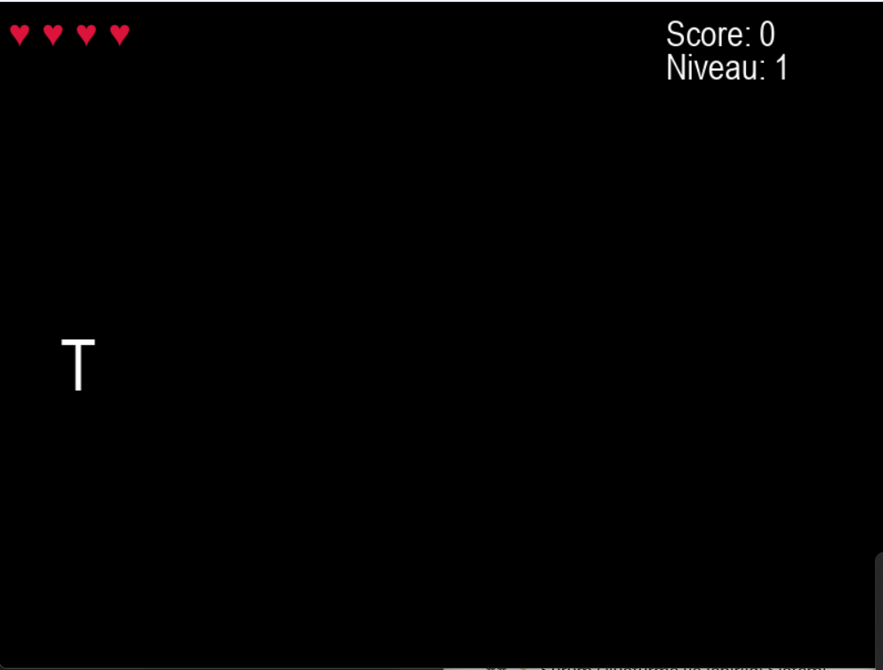
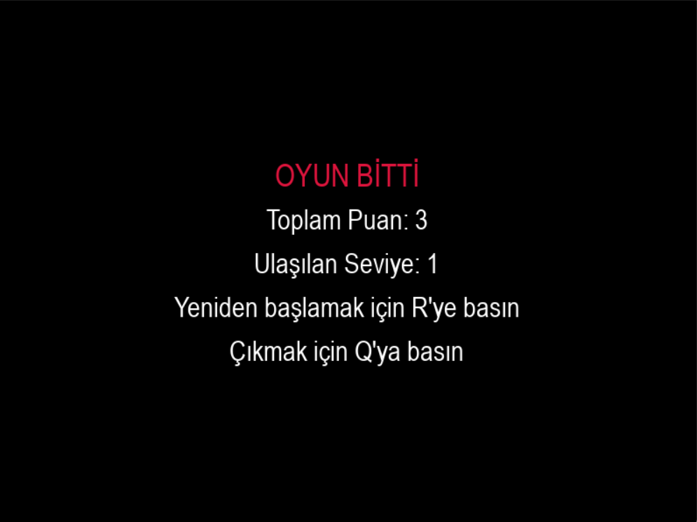

# 🎮 Typing Learn

**Typing Learn**, **Python ve Pygame** ile geliştirilmiş, kullanıcılara klavyede hızlarını ve hassasiyetlerini artırmada yardımcı olan ve aynı zamanda eğlendiren bir eğitim oyunudur.

## 👨‍💻 Ekip Bilgisi

- **Zakaria SAWADOGO** – [github.com/ZakariaSawadogo](https://github.com/ZakariaSawadogo)
- **Manar Ahmad SALEM** – [github.com/ManarSalem99](https://github.com/ManarSalem99)

## 📁 Projenin Yapısı
````
Pratical_Project/
│
├── main.py
├── Falling_word.py
├── Falling_letter.py
│
├── words/
│ ├── English.txt
│ ├── French.txt
│ ├── Spanish.txt
│ ├── German.txt
│ ├── Kurdish
│ └── Turkish.txt
│
├── sounds/
│ ├── home_music.wav
│ ├── correct_word.wav
│ ├── incorrect_word.wav
│ ├── game_over.wav
│ ├── healing.wav
│ ├── heart_lose.wav
│ └── keyboard_key
│
├── flags/
│ ├── english.png
│ ├── french.png
│ ├── exit.png
│ ├── german.png
│ ├── kurdish.png
│ ├── spanish.png
│ ├── arabic.png
│ ├── home.png
│ └── turkish.png
│
└── README.md
````

## 🎮 Oynanış

### 1. Ana menu



- Faling word**: Düşen kelimeler, oyuncu onları ekranın altına ulaşmadan önce yazmalıdır.
- Falling letter**: Düşen harfler, oyuncu onları ekranın altına ulaşmadan önce yazmalıdır.
- Exit**: Oyundan çıkın.


### 2. Falling word



- Puan kazanmak için düşen kelimeleri yazın.
- Art arda 3 doğru cevaptan sonra kalp kazanın.
- Bir kelime yere düşerse veya cevap yanlışsa kalp kaybedin.
- Zorluk her 5 doğru kelimede bir artar.



Oyuncu kelimelerin dilini seçebilir:
- 🇬🇧 İngilizce
- 🇫🇷 Fransızca
- 🇹🇷 Türkçe
- 🇪🇸 İspanyolca
- 🇩🇪 Almanca
- 🇹🇯 Kürtçe

### 3 Falling letter



- Puan kazanmak için düşen harfleri yazın.
- Art arda 5 doğru cevaptan sonra kalp kazanın.
- Art arda 2 harf yere düşerse veya 2 cevap yanlışsa kalpleri kaybedin.
- Zorluk her 5 doğru harfte bir artar (düşme hızı ve düşen harf sayısı artar).

### 4. Game over



Skor ve ulaşılan seviyenin görüntülenmesi.

## 🛠️ Kullanılan teknolojiler

- Python 3.13.3
- Pygame
- Git & GitHub

## ⏳ Sürüm Oluşturma ve İşbirliği Sistemi

- Proje **Git** ile sürümlendirildi.
- Her üye kendi **kişisel GitHub hesabını** kullandı.
- Geliştirme boyunca düzenli taahhütler.

📌 https://github.com/ZakariaSawadogo/Pratical_project.git

## 🎥 Video Gösterimi

👉 [Video link ](https://not_yet)

Bu videoda:
- Kaynak kodun hızlı sunumu
- Özelliklerin açıklanması
- Oynanış gösterimi
